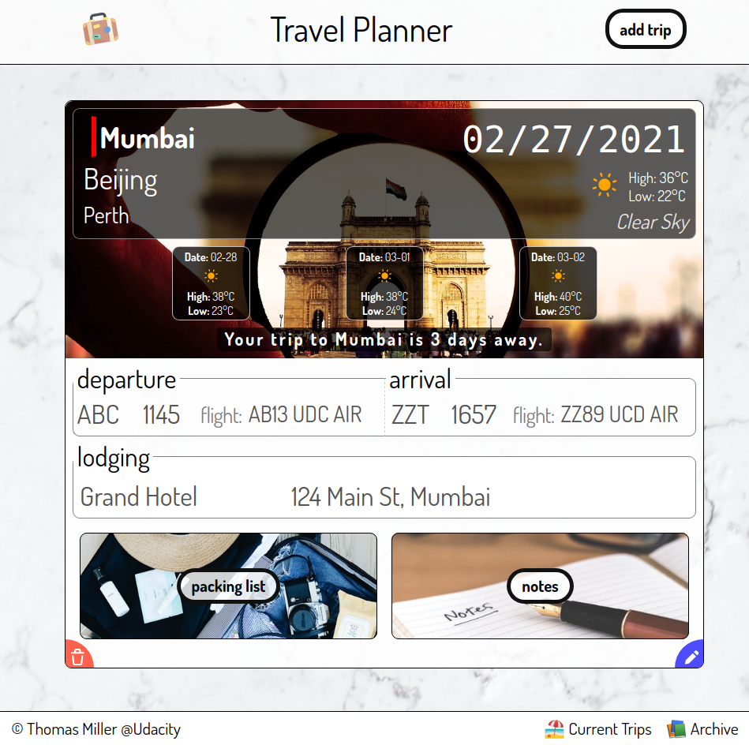

# CAPSTONE Travel Planner Project

## Overview

This is a travel app that can log up to 3 destinations with useful information per trip for the user. Weather, and location images are pulled via external APIs. Multiple trips can be created/deleted.

### Features and usage

Once loaded, either click on the button "add Trip" or scroll to the form in the page. Enter a city name followed by a "," and the [ISO Country Code](https://www.wikiwand.com/en/List_of_ISO_3166_country_codes) if needed. Click "check city weather" to have a preview of what the weather was last year. Once satisfied, click on "save trip." After gathering all of the information from the APIs, a trip card will be created showing the city and start date of the trip and weather.

Please note, the earliest date selectable to start a trip is "tomorrow."

#### Trip Card

*City specific information*
Each card shows the city name, background image, weather, departure flight information from your current city, arrival flight to the city on the card, and one hotel with address for your stay.

*Weather*
Depending on the number of days to the start of the trip, historic weather or a 4-day forecast is shown. Historic weather is the weather from last year with description and average temperature.
Anything a week or less will show a 4-day forecast, starting with the start date of the trip, and 3 additional mini-cards with dates. Hover over the weather icon in the mini-cards to see their respective description of the weather.

*Trip shared information*
There are a predetermined packing list of items and notes for the trip. The packing list items can be edited when in Edit mode.

*Editing*
Only the **active** city on the trip can have its information edited. On the bottom right of each card, there is an edit mode button. Once finished editing, click it again to close the editing mode and pull the missing data from the APIs. Once a trip is archived, it can no longer be edited.

*Deleting*
On the bottom left of each card you can delete the trip. A confirmation is shown before deletion from the page and storage object/local storage.

*Sorting*
Each trip is independently sorted once a start date is given for each city. The trips cards will show up as you have created them and not sort with other trip cards.

*Archiving*

                

After 7 days from the trip start date, the trip can then be archived. A clickable banner will show allowing you to move the trip to the archive. Once archived, the trip cannot be edited or reused, only deleted. 

To see all archived trips, go to the page footer and click "Archive." Click "Current Trips" to return to the active trips.

## Dependencies

This is an express.js app, and needs a few modules and APIs to run correctly.

### Node modules

Webpack 5
Express

Additional information is found in the package.json file

### APIs (APPLICATION PROGRAMMING INTERFACE)

Three APIs are used to get each city background image [PIXABAY](https://pixabay.com/api), coordinates for each city [GEONAMES](http://api.geonames.org/), and historic or current weather forecast [WEATHERBIT](https://www.weatherbit.io/).

These are required in order for the app to run and are stored as environment variables on the server.

Please refer to the .env_sample file for the same information listed below.

#### Weatherbit

WEATHERBIT_URL = https://api.weatherbit.io/v2.0/forecast/daily?

WEATHERBIT_KEY = *** insert your own key here ***

WEATHERBIT_HISTORIC_URL = https://api.weatherbit.io/v2.0/history/hourly

#### Pixabay

PIXABAY_URL = https://pixabay.com/api/

PIXABAY_KEY = *** insert your own key here ***

PIXABAY_SPECS = &image_type=photo&safesearch=true&orientation=horizontal&min_width=800

#### Geonames

GEONAMES_KEY = *** insert your own key here ***

GEONAMES_URL = http://api.geonames.org/searchJSON?q

## Installation Instructions

Copy or clone all of the files from the git repo.
If not already installed, install node/npm on your PC, please first use `npm init` to track all of your dependency installs. 
In the root directory where the package.json file is, type `npm install` to install all of the needed dependencies

Start the server from the root directory with `npm start` and it will start at port 5000 on the localhost. Change the port in the server.js file.
Start the dev server with command `npm run dev` and a webpage will open with port 9000 or any other port set in your webpack.dev.js file.

Please see [NMPJS](https://www.npmjs.com/) for full documentation.

## Extras

Animated weather icons are included to make the app more appealing

### Data storage

This app does not use a persistent database but local storage. All of the data saved will be linked to the same PC/Browser and not shareable among devices.

#### Task List / Future Features

- [ ] Sort Trip Cards themselves with other trip cards without a page reload
- [ ] ADD APIs for: 
  - [ ] Flight Information
  - [ ] Hotels
  - [ ] Directions
  - [ ] City/Country information for the user
- [ ] Allow manual change of background image for user preference
- [ ] If image is not found, use country name to search for background
- [ ] Printing functionality
- [ ] ADD multiple flights for each trip destination (May require redesign)
- [ ] ADD multiple hotels for each trip destination (May require redesign)
- [ ] Clone archived card to make a new trip
- [ ] ** **Find server to host demo** **

#### Thomas Miller 2021
